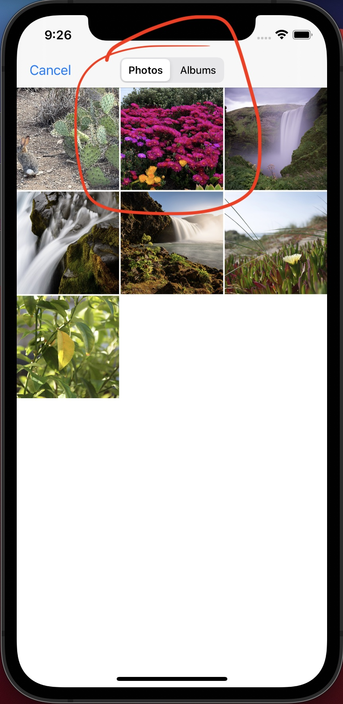

# Capacitor Camera Plugin EXIF Test App

https://capacitorjs.com/docs/apis/camera
https://github.com/ionic-team/capacitor-plugins/tree/main/camera

This plugin demonstrates the Capacitor Camera Plugin.
It allows you to select and image and then displays the associated EXIF information after you select it.

To set up this example:
```
git clone https://github.com/codeconsole/exiftest
cd exiftest
git checkout capacitor
```
Followed by:
```
./bin/capacitorInit.sh
```
or manually:
```
npm install
npx cap add ios
npx cap add android
cp conf/Info.plist ios/App/App/Info.plist
cp conf/AndroidManifest.xml android/app/src/main/AndroidManifest.xml
npx cap sync
```

Followed by
```
sdkmanager 'system-images;android-21;google_apis;x86_64'
avdmanager create avd --name Pixel_2_API_21 --package 'system-images;android-21;google_apis;x86_64' --device 'pixel_2'
sdkmanager 'system-images;android-22;google_apis;x86_64'
avdmanager create avd --name Pixel_2_API_22 --package 'system-images;android-22;google_apis;x86_64' --device 'pixel_2'
sdkmanager 'system-images;android-23;google_apis;x86_64'
avdmanager create avd --name Pixel_2_API_23 --package 'system-images;android-23;google_apis;x86_64' --device 'pixel_2'
sdkmanager 'system-images;android-24;google_apis;x86_64'
avdmanager create avd --name Pixel_2_API_24 --package 'system-images;android-24;google_apis;x86_64' --device 'pixel_2'
```

## Issue with Android 21-23
What this example demonstrates is capacitor.js won't load Android Lollipop and Marshmallow

https://github.com/ionic-team/capacitor/issues/5043


To replicate:
```
npx cap run android --target=Pixel_2_API_22  
```

results in 

```
capacitor.js:2 Uncaught SyntaxError: Use of const in strict mode.
```

## Issue with iOS Simulator Image Selection

What this example demonstrates is a specific photo can not be selected from the Simulator (Pink Flowers)

https://github.com/ionic-team/capacitor-plugins/issues/587

Followed by:
```
npx cap run ios
```





